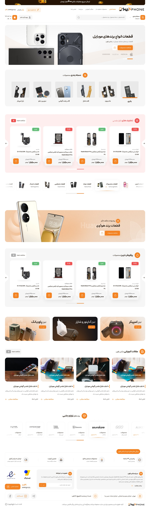

# Headless WordPress Next.js


<p align="center">
  
<!--    -->
</p>


<p align="justify">
A high-performance, SEO-optimized e-commerce and content platform built with Next.js 15 (App Router) and a headless WordPress backend. This project leverages the power of WPGraphQL, the WooCommerce REST API, and modern React tooling to deliver a fast, flexible, and scalable frontend experience.

## Can WordPress Be Used as the Backend for Next.js?

<p align="justify">
Absolutely. This project is a production-ready demonstration of using WordPress as a headless CMS. WordPress exposes its data via:

- **WPGraphQL** for posts, pages, categories, tags, and custom post types.
- **WooCommerce REST API** for product catalogs, categories, tags, and e-commerce data.

<p align="justify">
Next.js consumes these endpoints and renders a fully static or server-side rendered frontend, decoupling content management from presentation. The result is a website that combines WordPress's familiar admin interface with Next.js's performance and developer experience.

## Key Features

- **Next.js 15 App Router** with parallel routes, route groups, and dynamic routing.
- **Headless WordPress** integration via WPGraphQL for blog and page content.
- **Headless WooCommerce** integration via the official WooCommerce REST API for product data.
- **Apollo Client** for efficient GraphQL data fetching, caching, and state management.
- **TanStack React Query** for REST API calls (WooCommerce) with automatic background refetching and caching.
- **TypeScript** throughout for type safety and improved developer experience.
- **Tailwind CSS v4** with RTL support and custom utility classes.
- **Swiper** for touch-friendly sliders and carousels.
- **Modular component architecture** with clear separation of concerns (e.g., `plp` components, `ui` primitives).
- **Dynamic imports** and code splitting for optimal performance.

## Project Structure
The project follows a scalable folder structure designed for maintainability and separation of concerns.

```text
MAXPHONE/
├── .next/                      # Next.js build output
├── node_modules/               # Dependencies
├── public/                     # Static assets
├── src/
│   ├── app/                    # Next.js App Router
│   │   ├── (home)/             # Landing page route group
│   │   │   ├── components/     # Home-specific components
│   │   │   │   ├── Banner.tsx
│   │   │   │   ├── BannerSlider.tsx
│   │   │   │   ├── BrandSlider.tsx
│   │   │   │   ├── CategoryGrid.tsx
│   │   │   │   ├── HeroSlider.tsx
│   │   │   │   └── SecondBrandSlider.tsx
│   │   │   └── page.tsx        # Home page entry
│   │   │
│   │   ├── (post)/             # Blog route group
│   │   │   └── blog/           
│   │   │       └── [slug]/     # Single post dynamic route
│   │   │           ├── components/
│   │   │           │   ├── HeroPost.tsx
│   │   │           │   ├── PostFooter.tsx
│   │   │           │   └── Sidebar.tsx
│   │   │           └── page.tsx
│   │   │
│   │   ├── shop/               # Shop listing page
│   │   │    └── page.tsx   
│   │   │
│   │   ├── product-category/   # Category listing
│   │   │      └── [slug]/
│   │   │          └── page.tsx   
│   │   │
│   │   ├── product-tag/        # Tag listing
│   │   │     └── [slug]/
│   │   │         └── page.tsx   
│   │   │       
│   │   ├── product/            # Single Product
│   │   │   └── [id]/
│   │   │       ├── components/ 
│   │   │       │   ├── FeaturesSection.tsx
│   │   │       │   ├── ProductActions.tsx
│   │   │       │   ├── ProductImageSlider.tsx
│   │   │       │   ├── ProductInfo.tsx
│   │   │       │   ├── ProductPurchaseInfo.tsx
│   │   │       │   └── ProductTabsSection.tsx
│   │   │       └── page.tsx
│   │   │
│   │   ├── about/              # About Us
│   │   │   ├── components/
│   │   │   │   ├── AboutHero.tsx
│   │   │   │   ├── MaxPhoneAbout.tsx
│   │   │   │   └── MaxPhoneServices.tsx
│   │   │   └── page.tsx
│   │   │
│   │   ├── blog/               # Blog Index
│   │   │   ├── components/
│   │   │   │   ├── BlogHero.tsx
│   │   │   │   └── BlogTrending.tsx
│   │   │   └── page.tsx
│   │   │
│   │   ├── contact/            # Contact Page
│   │   │   ├── components/
│   │   │   └── page.tsx
│   │   │
│   │   ├── search/             # Search Results
│   │   │   └── page.tsx
│   │   │
│   │   ├── global.css          # Global styles
│   │   ├── favicon.ico         # Site favicon
│   │   ├── fonts.ts            # Font configuration
│   │   └── layout.tsx          # Root layout
│   │
│   ├── components/             # Reusable global components
│   │   ├── ui/                 # Basic UI primitives
│   │   │   ├── Breadcrumb.tsx
│   │   │   ├── Button.tsx
│   │   │   ├── Icon.tsx
│   │   │   ├── Pagination.tsx
│   │   │   └── SectionTitle.tsx
│   │   │
│   │   ├── plp/                # Product Listing Page components
│   │   │   ├── CategorySlider.tsx
│   │   │   ├── Filters.tsx
│   │   │   └── SortBar.tsx
│   │   │
│   │   ├── BlogCard.tsx
│   │   ├── Comments.tsx
│   │   ├── BlogSlider.tsx
│   │   ├── ProductCard.tsx
│   │   ├── ProductSlider.tsx
│   │   ├── MegaMenu.tsx
│   │   ├── Footer.tsx
│   │   └── Header.tsx
│   │
│   ├── types/                  # TypeScript interfaces and types
│   │   └── index.tsx
│   │
│   ├── hooks/                  # Custom React hooks
│   │    ├── useProductQuery.ts   
│   │    ├── useCategoryQuery.ts 
│   │
│   ├── providers/              # Context Providers
│   │    └── QueryProvider.tsx   # React Query Provider
│   │
│   └── lib/                    # Core utilities and API clients
│       └── api/
│           ├── core/           # Client initialization
│           │   ├── apolloClient.ts       # GraphQL Client
│           │   └── wooCommerceClient.ts  # REST API Client
│           │
│           ├── graphql/        # GraphQL Operations
│           │   ├── queries/    # Query definitions
│           │   │   ├── blog/
│           │   │   │   └── queries.ts
│           │   │   └── home/
│           │   │       └── queries.ts
│           │   └── mutations/
│           │       └── userMutations.ts
│           │
│           ├── services/       # Business logic / Service layer
│           │   ├── homeService.ts
│           │   ├── aboutService.ts
│           │   ├── archiveService.ts
│           │   ├── blogService.ts
│           │   ├── pageService.ts
│           │   ├── postService.ts
│           │   ├── productService.ts
│           │   └── searchService.ts     
│           │
│           └── mockData.ts     # Mock data for development/testing
│
└── README.md
